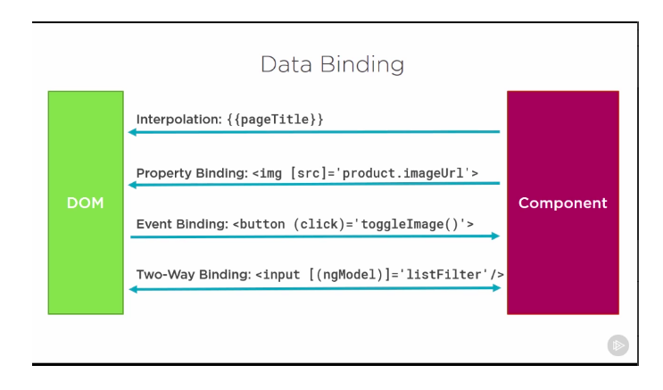

# Angular

Typescript can't be executed in the browser, it needs to be compiled into javascript (vanilla).

Transcript = change from one language to another

To create a new project in Angular: `ng new miApp`

Give permissions (avoid this):  
`sudo chown -R pandres .`

To run a local server: `ng serve -p 4200 -o` the o is to open the browser

Kill the process on 4200: `sudo kill $(sudo lsof -t -i:4200)`

Default port in Angular: 4200

The selector tells to Angular where to find the place where it needs to place the components.

The **first** code which is executed is the "main.ts" file.

The cycle is like this:  
 `main.ts -> app.module.ts -> app component`

Each **component** has its own markup, style and logic.

At the end of the day, there is only one module, which is the app module, which in turn receive the imports from the rest of the modules (components).

## Convention

The project structure for a new component should be:

    - App
      - components
        - navbar
            navbar.component.ts
            navbar.component.html
            navbar.component.css

The basic component declaration must be as follows:

```typescript
import { Component } from '@angular/core';

@Component({
  selector: 'app-navbar',
  templateUrl: 'navbar.component.html',
  styleUrl: 'navbar.component.css',
})
export class NavbarComponent {}
```

## Markup & Style

If there is more than 4 lines of markup in the template, just write in the js file (inline).

Else, use `templateUrl`.

The same with styles:  
its possible to just write:

`styles: [ h3 {color: blue}]`

## Selectors in the components

The most common way to do things is to use `selector: 'app-servers'`  
`<app-servers></app-servers>`

But you can selector with attribute:  
`selector: '[app-servers]'`  
`<div app-servers="something"></div>`

Or even classes:  
`selector: '.app-servers'`  
`<div class="app-servers"></div>`

## Project Structure

The folder **e2e** is for automatic tests

## Create component using the CLI

To create a new component: `ng g c components/footer`

g : generates
c : component

To create a new component without style sheet: `ng g c components/about -si`

To create a new component without spec file: `ng g c component --spec false`

## Databinding

Databinding = Communication

We need communication between our TypeScript Code (Business Logic) and the Template (HTML).

There are different type of communication:

- Output Data: - String Interpolation({{ data }})
  - Property Binding([property] = "data")
- React to (User) Events:

  - Event Binding ((event)="expression")

- Combination of both:
  - Two-Way-Binding([(ngModel)]="data")



## String Interpolation

The way of using it: {{ string-expression }}  
Everything inside must return a **string** or something that can be easily converted to a string.

## Property Binding

Example:  
`<p [innerText]='stringVariable'></p>`

## Routes

To use the snippet to create the routes: `ng-router-app`

## Structural Directives

**Directives are instructions in the DOM.**

Two main types: ngIf & ngFor

\*ngIf

### ngIf with Else condition

```html
<p *ngIf="serverCreated" ; else noServer>
  Server was created, server name is {{ serverName }}
</p>
<ng-template #noServer>
  <p>No server was created</p>
</ng-template>
```

### ngStyle to styling elements dynamically

`<p [ngStyle]="{ backgroundColor: getColor() }">{{ server }} with ID {{ getServerStatus() }}</p>`

### ngClass to applying CSS classes

`<p [ngClass]="{ online: serverStatus === 'online' }">{{ server }} with ID {{ getServerStatus() }}</p>`

### ngFor to outputting Lists

---

---

---

## Until section 5

Until section 5, what I've learned so far is:

- Create components (hard coded or using CLI).
- The default Angular Project structure.
- How to create Models (like classes for typescript).
- How to data bind into the components:
  - using **structural directives** such us ngFor, ngIf, etc.
  - using **string interpolation** : {{ stringValue }}
  - using **property binding** : [innerText]='some string'
- Debugging in Angular:
  - Using the dev tools of Chrome ( sources map )
  - Using the extension **Auguri**

---

---

---

## Property & Event Binding

- **HTML Elements** : Native Properties & Events
- **Directives** : Custom Properties & Events
- **Components** : Custom Properties & Events

IMPORTANT: By default, properties inside the components are only accessible by INSIDE the component. NOT from outside. THIS IS SOMETHING POSITIVE.

If we want to use it in other components, we must include a decorator:  
`@Input() element: {type: string, name: string}`

Sometimes you want to use different property from the inside and the outside of the component. So Angular let's you to pass some options to Init():  
`@Input('srvElement)` : srvElement can be used from the OUTSIDE of the component.

## View (styles) Encapsulation

Angular forces the behavior of the browser. Allows to isolate each of the components applying their own styles.

THE IMPORTANT THING IS:  
The **type of encapsulation** (or not) can be changed in each component:  
emulated || none || native

remember to import: 'ViewEncapsulation' from Angular/core

In the decorator @Component:  
encapsulation: ViewEncapsulation.[options]

## Local References in Templates

To create a local reference:

```html
<input type="text" class="form-control" #serverNameInput />
```

Then the reference: serverNameInput, can be used anywhere BUT ONLY on the template, for example:

```html
<button (click)="onAddServer(serverNameInput)>
```

## LIFECYCLE

- **ngOnChanges** : called after a bound input property changes.
- **ngOnInit** : called once the component is initialized.
- **ngDoCheck** : called during every change detection run.
- **ngAfterContentInit** : called after content (ng-content) has been projected into view
- **ngAfterContentChecked** : called every time the projected content has been checked.
- **ngAfterViewInit** : called after the component's view (and child views) has been initialized.
- **ngAfterViewChecked** : called every time the view (and child views) have been checked.
- **ngOnDestroy** : called once the component is about to be destroyed.

## ViewChild and ContentChild

Useful to use Local References.

## SECTION 7: DIRECTIVES DEEP DIVE

There are two types of directives: **ATTRIBUTE** & **STRUCTURAL** DIRECTIVES

- Attribute Directives :

  - Look like a normal HTML Attribute (possible with data binding or event binding)
  - Only affect/change the element they are added to

- Structural Directives:
  - Look like a normal HTML Attribute but have a leading \* (for desugaring)
  - Affect a whole area in the DOM (elements get added/removed)

### Create a basic directive:

It can be created using the CLI: `ng g d name-of-directive`

```typescript
import { Directive, ElementRef, OnInit } from '@angular/core';

@Directive({
  selector: '[appBasicHighlight]',
})
export class BasicHighlightDirective implements OnInit {
  constructor(private elementRef: ElementRef) {}

  ngOnInit() {
    this.elementRef.nativeElement.style.backgroundColor = 'green';
  }
}
```

Don't forget to import it in the AppModule

A better way of do things is using "render" to manipulate the attributes of the DOM:

```typescript
import { Directive, Renderer2, ElementRef } from '@angular/core';

@Directive({
  selector: '[appBetterHighlight]',
})
export class BetterHighlightDirective {
  constructor(private elRef: ElementRef, private renderer: Renderer2) {}

  ngOnInit() {
    this.renderer.setStyle(
      this.elRef.nativeElement,
      'background-color',
      'blue'
    );
  }
}
```

Documentation about Render: <https://angular.io/api/core/Renderer2>

### Host Listeners example

```typescript
@HostListener('mouseenter') mouseover(eventData: Event) {
    this.renderer.setStyle(this.elRef.nativeElement, 'background-color', 'blue');
  }

  @HostListener('mouseleave') mouseleave(eventData: Event) {
    this.renderer.setStyle(this.elRef.nativeElement, 'background-color', 'transparent');
  }
```

### Host binding

```typescript
  @HostBinding('style.backgroundColor') backgroundColor: string = 'transparent';

  @HostListener('mouseenter') mouseover(eventData: Event) {
    this.backgroundColor = 'blue';
  }

  @HostListener('mouseleave') mouseleave(eventData: Event) {
    this.backgroundColor = 'transparent';
  }
```

## Section: 9 - Using Services & Dependency Injection

### Service Injection

Services must be created in the folder where the feature belongs to.

First create a service:

```typescript
export class LoggingService {
  logStatusChange(status: string) {
    console.log('A server status changed, new status: ' + status);
  }
}
```

Make the injection:

```typescript
import { Component, EventEmitter, Output } from '@angular/core';
import { LoggingService } from '../logging/logging.service';

@Component({
  selector: 'app-new-account',
  templateUrl: './new-account.component.html',
  styleUrls: ['./new-account.component.css'],
  providers: [LoggingService],
})
export class NewAccountComponent {
  @Output() accountAdded = new EventEmitter<{ name: string; status: string }>();

  constructor(private loggingService: LoggingService) {}

  onCreateAccount(accountName: string, accountStatus: string) {
    this.accountAdded.emit({
      name: accountName,
      status: accountStatus,
    });
    this.loggingService.logStatusChange(accountStatus);
  }
}
```

### Hierarchical Injector

- App Module : Same instance of Service is available Application-wide
- AppComponent : Same instance of Service is available for all Components (but not for other Services)
- Any other Component : Same instance of Service is available for the Component and all its child components

Use the **provider** section of the App.Module to the place WHERE to declare the instance of the Service. It's possible to have multiple instances of the same service, but most probably the best idea it's to make the instance in the "provider" in the app component level, so can be accessed through the entire application.

## ROUTING

In **app.module.ts** :

- Import **Routes and RouterModule**
- Declare the routes
- In imports, **RouterModule.forRoot(appRoutes)**

```typescript
import { Routes, RouterModule } from '@angular/router';

const appRoutes: Routes = [
  { path: '', component: HomeComponent },
  { path: 'users', component: UsersComponent },
  { path: 'servers', component: ServersComponent },
];

@NgModule({
  declarations: [
    AppComponent,
    HomeComponent,
    UsersComponent,
    ServersComponent,
    UserComponent,
    EditServerComponent,
    ServerComponent,
  ],
  imports: [BrowserModule, FormsModule, RouterModule.forRoot(appRoutes)],
  providers: [ServersService],
  bootstrap: [AppComponent],
})
export class AppModule {}
```

In **app.component.html**:

```HTML
<div class="container">
  <div class="row">
    <div class="col-xs-12 col-sm-10 col-md-8 col-sm-offset-1 col-md-offset-2">
      <ul class="nav nav-tabs">
        <li role="presentation" class="active"><a routerLink="/">Home</a></li>
        <li role="presentation"><a routerLink="/servers">Servers</a></li>
        <li role="presentation"><a [routerLink]="['/users']">Users</a></li>
      </ul>
    </div>
  </div>
  <div class="row">
    <div class="col-xs-12 col-sm-10 col-md-8 col-sm-offset-1 col-md-offset-2">
      <router-outlet></router-outlet>
    </div>
  </div>
</div>
```

Active routes can be styled using **routerLinkActive="active**

To go programmatically: **router.navigate(["/servers"])**

It's possible to use relative routes, using **route: ActivatedRoute** and use the method **relativeTo**

**Params and query params**

**nested routes are possible** using children

**redirection**

---

# OBSERVABLES

Observables: various Data Sources (User Input) Events, Http Requests, Triggered in Code, ...

Observer:

- Handle Data
- Handle Error
- Handle Completion

Observables may return values even we are not interested on them anymore. It's **important** to unsubscribe to every obersvable which we are not interested on anymore.

All the observables **provided** by Angular manage the cycle for us. So it's not necessary to unsubscribe from them. Angular does it automatically for us.

Example of custom observable:

```typescript
import { Component, OnInit, OnDestroy } from '@angular/core';

import { interval, Subscription, Observable } from 'rxjs';

@Component({
  selector: 'app-home',
  templateUrl: './home.component.html',
  styleUrls: ['./home.component.css'],
})
export class HomeComponent implements OnInit, OnDestroy {
  private firstObsSubscription: Subscription;

  constructor() {}

  ngOnInit() {
    // this.firstObsSubscription = interval(1000).subscribe(count => {
    //   console.log(count);
    // });
    // custom observable
    const customObservable = Observable.create(observer => {
      let count = 0;
      setInterval(() => {
        observer.next(count);
        if (count === 2) {
          observer.complete();
        }
        if (count > 3) {
          observer.error(new Error('Count is greater than 3!'));
        }
        count++;
      }, 1000);
    });

    this.firstObsSubscription = customObservable.subscribe(
      data => {
        console.log(data);
      },
      error => {
        console.log(error);
        alert(error.message);
      },
      () => {
        console.log('completed!');
      }
    );
  }

  ngOnDestroy(): void {
    this.firstObsSubscription.unsubscribe();
  }
}
```

### OPERATORS

Operators are mid operations that we can apply to our Observables. Must be included in the pipe() function.

There are tons of operators, some of them are: map, filter, etc.

Example:

```typescript
import { Component, OnInit, OnDestroy } from '@angular/core';

import { interval, Subscription, Observable } from 'rxjs';
import { map, filter } from 'rxjs/operators';

@Component({
  selector: 'app-home',
  templateUrl: './home.component.html',
  styleUrls: ['./home.component.css'],
})
export class HomeComponent implements OnInit, OnDestroy {
  private firstObsSubscription: Subscription;

  constructor() {}

  ngOnInit() {
    // this.firstObsSubscription = interval(1000).subscribe(count => {
    //   console.log(count);
    // });
    // custom observable
    const customObservable = Observable.create(observer => {
      let count = 0;
      setInterval(() => {
        observer.next(count);
        if (count === 2) {
          observer.complete();
        }
        if (count > 3) {
          observer.error(new Error('Count is greater than 3!'));
        }
        count++;
      }, 1000);
    });

    this.firstObsSubscription = customObservable
      .pipe(
        filter(data => {
          return data > 0;
        }),
        map((data: number) => {
          return 'Round: ' + (data + 1);
        })
      )
      .subscribe(
        data => {
          console.log(data);
        },
        error => {
          console.log(error);
          alert(error.message);
        },
        () => {
          console.log('completed!');
        }
      );
  }

  ngOnDestroy(): void {
    this.firstObsSubscription.unsubscribe();
  }
}
```

The best practice is not using EventEmitters when they are not @Output. Instead, is better to use subscription.  
Must be imported from: `import { Subscription } from 'rxjs';`

Instead of using "emit", use "next".

## FORMS

There are two approaches to solve forms in Angular:

- Template-Driven (TD) vs Reactive Approach

**Template-Driven** : Angular infers the Form Object from the DOM
**Reactive** : Form is created programmatically and synchronized with the DOM

Don't forget to import in app.modules:
`import { FormsModule } from '@angular/forms';`  
`imports: [ BrowserModule, FormsModule, ],`

Angular will not detect automatically the inputs in our **forms**. `ngModel` must be used to inform Angular.

Set up the HTML (pay attention to the form line):

```HTML
<div class="container">
  <div class="row">
    <div class="col-xs-12 col-sm-10 col-md-8 col-sm-offset-1 col-md-offset-2">
      <form (ngSubmit)="onSubmit(f)" #f="ngForm">
        <div id="user-data">
          <div class="form-group">
            <label for="username">Username</label>
            <input
              type="text"
              id="username"
              class="form-control"
              ngModel
              name="username"
            />
          </div>
          <button class="btn btn-default" type="button">
            Suggest an Username
          </button>
          <div class="form-group">
            <label for="email">Mail</label>
            <input
              type="email"
              id="email"
              class="form-control"
              ngModel
              name="email"
            />
          </div>
        </div>
        <div class="form-group">
          <label for="secret">Secret Questions</label>
          <select id="secret" class="form-control" ngModel name="secret">
            <option value="pet">Your first Pet?</option>
            <option value="teacher">Your first teacher?</option>
          </select>
        </div>
        <button class="btn btn-primary" type="submit">Submit</button>
      </form>
    </div>
  </div>
</div>

```

Angular by default disables HTML5 validation, to activate it's necessary to included in the control: `ngNativeValidate`

**Setting** value to initialize a value for a form.

**Patching** value to overwrite the value of a form.

**reset()** resets the form.

## PIPES

Pipes transform values.

`<p>{{ username | uppercase }}</p>`

Pipes are only responsible of the output response.

Official documentation: <https://angular.io/api?query=pipe>

Chaining pipes: `{{ server.started | date: 'fullDate' | uppercase }}`

### Creating custom pipes

Name convention: **mypipe.pipe.ts**

Example custom pipe:

```typescript
import { PipeTransform, Pipe } from '@angular/core';

@Pipe({
  name: 'shorten',
})
export class ShortenPipe implements PipeTransform {
  transform(value: any, limit: number) {
    if (value.length > limit) {
      return value.substr(0, 10) + '...';
    }
    return value;
  }
}
```

Don't forget to import in **app.module.ts**

Used in the html: `<strong>{{ server.name | shorten: 5 }}</strong>`

We can use CLI: **ng g p name-of-pipe**

## HTTP REQUESTS

**Firebase** (service of complete free back end): <https://firebase.google.com/?hl=es-419>

Include in @NgModule, the **HttpClientModule**
