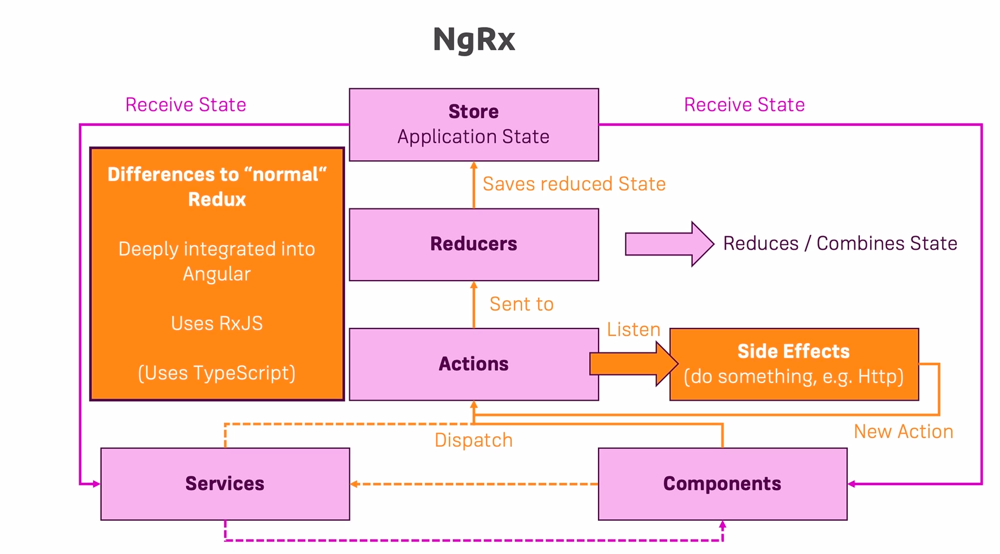

# NgRx

Install ngrx:  
`npm install --save @ngrx/store`

State changes in ngrx must be immutable.

It's **forbidden** to add or extract from the existing state. The best practice is to create a copy of the state:  
