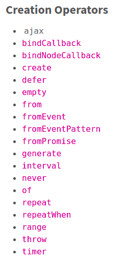
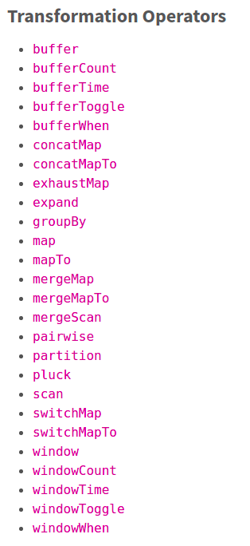
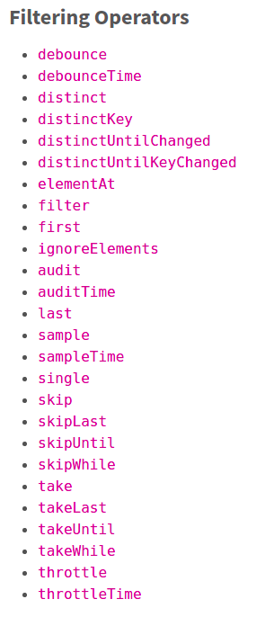

# RXJS

Documentation: <http://reactivex.io/rxjs/manual/overview.html>

**Observable** : producer of multiple values

**Observers** : Consumers of data

Subscribing to an Observable is analogous to calling a function.

Observables are able to deliver values either synchronously or asynchronously

Observables can return multiple values.

Summary:
  - `func.call()` means "give me one value syncrhonously"
  - `observable.subscribe()` means "give me any amount of values, either synchronously or asynchronously"

CREATING OBSERVABLES

Observables can be created with `create`, but usually **creation operators** are used, life: `of`, `from`, `interval`, etc.

SUBSCRIBING TO OBSERVABLES

Subscribing to an Observable is like calling a function, providing callbacks where the data wil be delivered to.

EXECUTING OBSERVABLES

In an Observable Execution, zero to infinite Next notifications may be delivered. If either an Error or Complete notification is delivered, then nothing else can be delivered afterwards.

DISPOSING OBSERVABLES EXECUTIONS

When you subscribe, you get back a Subscription, which represents the ongoing execution. Just call `unsubscribe()` to cancel de execution.

## Observer

Observer is a consumer of values delivered by an Observable. Are a simply set of callbacks, one for each type of notification delivered by the Observable: next, error and complete.

Observers are just objects with three callbacks, one for each type of notification that an Observable may deliver.

## Subject

A Subject is like an Observable, but can multicast to many Observers. Subjects are like EventEmitters: they maintain a registry of many listeners.

Every Subject is an Observable. 

## BehaviorSubject

BehaviorSubjects are useful for representing "values over time". For instance, an event stream of birthdays is a Subject, but the stream of a person's age would be a BehaviorSubject.

## Operators

An Operator is a function which creates a new Observable based on the current Observable. This is a pure operation: the previous Observable stays unmodified.

There are operators for different purposes, and they may be categorized as: **creation**, **transformation**, **filtering**, **combination**, **multicasting**, **error handling**, **utility**, etc.

